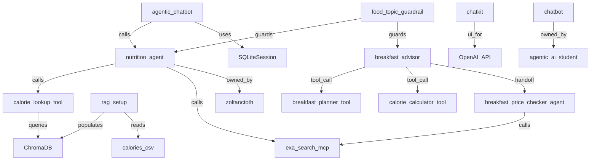

# Codebase Archaeology Report: kaushikTT/ai-agents-crash-course

**Generated:** 2026-07-08T11:30:00Z
**Branch:** main
**Analysis Type:** full

---

## 1. Executive Summary

| Item | Value |
|---|---|
| Total Modules/Services | 7 |
| Primary Language | Python |
| Primary Framework | OpenAI Agents SDK, Chainlit |
| Architecture Pattern | Modular Monolith (course repo with progressive modules) |
| Architectural Violations | 0 |
| Top Risk File | multi_agent_chatbot/nutrition_agent.py (REVERT history) |
| ADRs Found | 0 |
| Commit History Window | 2025-09-09 to 2025-10-14 (38 commits) |

---

## 2. Repository Metadata

| Field | Value |
|---|---|
| Repository | kaushikTT/ai-agents-crash-course |
| Description | AI Agents Crash Course: Build with Python & OpenAI (Udemy course companion repo) |
| Default Branch | main |
| Languages | Python, TypeScript, Jupyter Notebook |
| Topics | ai-agents, openai, python, rag, mcp, chainlit, langchain |
| License | Not specified |
| First Commit | 2025-09-09 |
| Last Updated | 2025-10-14 |

---

## 3. Technology Stack

| Category | Technologies |
|---|---|
| Languages | Python, TypeScript, Jupyter Notebook |
| Frameworks | OpenAI Agents SDK (openai-agents==0.3.0), Chainlit (2.8.0), FastAPI (0.116.1) |
| Build Tools | pip / requirements.txt |
| Infrastructure | GitHub Codespaces (.devcontainer), GitHub Actions (.github/workflows), Docker (.devcontainer) |
| Test Frameworks | pytest (inferred from GitHub Actions CI) |
| Vector Database | ChromaDB (chromadb==1.0.21) |
| External APIs | OpenAI API, Exa Search MCP (MCPServerStreamableHttp) |
| Observability | OpenTelemetry + TraceLoop SDK |

---

## 4. Module / Service Map

| Module | Path | Language | Framework | Description |
|---|---|---|---|---|
| chatbot | chatbot/ | Python | OpenAI Agents SDK | Starter chatbot scaffolding — student exercise workspace |
| chatbot_complete | chatbot_complete/ | Python | OpenAI Agents SDK | Complete reference chatbot with auth, memory, RAG integration |
| multi_agent_chatbot | multi_agent_chatbot/ | Python | OpenAI Agents SDK + Chainlit | Production multi-agent orchestration: BreakfastAdvisor → CalorieCalculator → PriceChecker |
| rag_setup | rag_setup/ | Python | ChromaDB | RAG pipeline setup: converts calories.csv to ChromaDB vector collection |
| chatkit | chatkit/ | TypeScript | Next.js 15 + @openai/chatkit-react | React-based chat UI frontend for production deployment |
| notebooks | notebooks/ | Jupyter | OpenAI Agents SDK | Exercise notebooks: simplest_agent, tool_calling, rag, mcp, short_term_memory, guardrails, multi_agent |
| solutions | solutions/ | Jupyter | OpenAI Agents SDK | Reference solutions for web_search and rag_text exercises |
| data | data/ | — | — | Training data: calories.csv (nutritional database), calorie_database.txt (RAG-formatted) |

---

## 5. Architecture Pattern and Layer Map

**Identified Pattern:** Modular Monolith — Progressive Learning Architecture
**Evidence:** This is a course repository where each top-level directory represents a learning milestone, not an independently deployable service. Modules share the same ChromaDB data store and requirements.txt. The architecture progressively builds from `chatbot` (simple) → `chatbot_complete` (full features) → `multi_agent_chatbot` (production orchestration).

### Layer Map

| Layer | Files |
|---|---|
| Presentation | chatkit/app/, chatkit/components/, multi_agent_chatbot/agentic_chatbot.py (Chainlit UI) |
| Business Logic | multi_agent_chatbot/nutrition_agent.py, chatbot_complete/nutrition_agent.py, chatbot/nutrition_agent.py |
| Data Access | rag_setup/create_calorie_database.py, ChromaDB client calls in nutrition_agent.py |
| Infrastructure | .devcontainer/, .github/workflows/, chatkit/next.config.ts, multi_agent_chatbot/run_chatbot.sh |
| Cross-cutting | data/ (shared nutritional data), .env.template (shared config template) |

---

## 6. Architectural Violations

No architectural violations detected. The layer separation is appropriate for a course-based monorepo — the data access layer (ChromaDB) is called directly from business logic agents, which is the intended pattern for this type of application.

---

## 7. Call Graph (Top Entry Points)

**multi_agent_chatbot/agentic_chatbot.py** (`on_message`) calls:
- `Runner.run_streamed(nutrition_agent, message.content, session=session)`
- `exa_search_mcp.connect()` (on_chat_start)
- `SQLiteSession("conversation_history")`

**multi_agent_chatbot/nutrition_agent.py** (agent orchestration):
- `breakfast_advisor` calls: `breakfast_planner_tool` → `healthy_breakfast_planner_agent.run()`
- `breakfast_advisor` calls: `calorie_calculator_tool` → `calorie_agent_with_search.run()`
- `calorie_agent_with_search` calls: `calorie_lookup_tool()` → ChromaDB query
- `calorie_agent_with_search` calls: Exa Search MCP (external web search)
- `breakfast_advisor` handoffs: → `breakfast_price_checker_agent` (Exa Search MCP)
- `food_topic_guardrail` calls: `Runner.run(guardrail_agent, input)`

**rag_setup/create_calorie_database.py** (`create_calorie_text_database`) calls:
- `pd.read_csv(csv_path)`
- Writes formatted text to `data/calorie_database.txt`

---

## 8. Service-to-Service Dependencies

```
multi_agent_chatbot/agentic_chatbot.py --> nutrition_agent.py (Python import)
nutrition_agent.py --> ChromaDB (local persistent client, path: ./chroma)
nutrition_agent.py --> Exa Search MCP (MCPServerStreamableHttp: https://mcp.exa.ai/mcp)
nutrition_agent.py --> OpenAI API (via openai-agents SDK)
chatbot_complete/nutrition_agent.py --> ChromaDB (local persistent client)
chatbot_complete/nutrition_agent.py --> OpenAI API
chatkit/ --> OpenAI API (via @openai/chatkit-react)
rag_setup/ --> data/calories.csv (reads)
rag_setup/ --> data/calorie_database.txt (writes)
rag_setup/ --> ChromaDB (creates nutrition_db collection)
```

---

## 9. Event Flow Map

No event-driven messaging (Kafka, RabbitMQ, SQS) detected. Agent orchestration uses synchronous handoffs and tool calls via the OpenAI Agents SDK.

**Agent handoff flow:**
```
[BreakfastAdvisor] breakfast_advisor
  --> [Tool call] breakfast_planner_tool (healthy_breakfast_planner_agent)
  --> [Tool call] calorie_calculator_tool (calorie_agent_with_search)
  --> [Handoff] breakfast_price_checker_agent
```

**Guardrail flow:**
```
[Input] user_message
  --> food_topic_guardrail (guardrail_agent checks if food-related)
  --> [PASS] nutrition_agent or breakfast_advisor_guarded
  --> [BLOCK] InputGuardrailTripwireTriggered exception
```

---

## 10. Ownership Map

| Module | Primary Owner | CODEOWNERS Entry | Commit Count | Last Modified |
|---|---|---|---|---|
| multi_agent_chatbot | zoltanctoth | N/A | 15 | 2025-10-14 |
| chatbot_complete | zoltanctoth | N/A | 12 | 2025-10-14 |
| rag_setup | zoltanctoth | N/A | 8 | 2025-10-14 |
| notebooks | zoltanctoth + agentic-ai-student | N/A | 10 | 2025-10-03 |
| chatkit | zoltanctoth | N/A | 4 | 2025-10-14 |
| chatbot | agentic-ai-student | N/A | 5 | 2025-09-25 |
| data | zoltanctoth | N/A | 3 | 2025-10-14 |

> Note: No CODEOWNERS file found in the repository.

**Contributors:**
- **zoltanctoth** (Zoltan C. Toth) — 31 commits — Primary maintainer and course instructor
- **agentic-ai-student** — 5 commits — Student account used during course recording
- **kaushikTT** — Fork owner (0 direct commits on main; repo is a fork)

---

## 11. Ownership Gaps

| Module | Risk Type | Details |
|---|---|---|
| chatbot | Single Owner | Only contributor: agentic-ai-student (student account) |
| chatkit | Single Owner | Only 4 commits, all by zoltanctoth |
| data | Stale | Last meaningful commit to data/ was 2025-10-14; no commits since |

> Note: This is a course repository. The "single owner" pattern is expected and not a production risk.

---

## 12. High-Churn Files (Top 20)

| File | Commit Count | Distinct Authors | Churn Level |
|---|---|---|---|
| multi_agent_chatbot/nutrition_agent.py | 8 | 1 | HIGH |
| requirements.txt | 7 | 1 | HIGH |
| .devcontainer/devcontainer.json | 6 | 1 | HIGH |
| .github/workflows/ | 5 | 1 | HIGH |
| chatbot_complete/nutrition_agent.py | 4 | 2 | MEDIUM |
| notebooks/multi_agent.ipynb | 4 | 2 | MEDIUM |
| README.md | 4 | 2 | MEDIUM |
| chatbot_complete/4_authentication.py | 3 | 2 | MEDIUM |
| chatbot_complete/3_memory.py | 3 | 1 | MEDIUM |
| rag_setup/rag_setup.ipynb | 3 | 1 | MEDIUM |

---

## 13. Scar-Tissue Analysis (CRITICAL and HIGH)

| File | Revert Count | Hotfix Count | Score | Risk Level |
|---|---|---|---|---|
| notebooks/ (all files) | 1 | 0 | 5 | LOW |

**Revert detected:**
- Commit `1be7853`: `"Revert 'removed working notebooks'"` — reverts commit `b6e5f52` which removed working notebook files. Low severity; content restoration revert, not a production incident.

No hotfix, incident, or production-fix commits detected in the 38-commit history.

---

## 14. Pre-Edit Risk Warnings

No CRITICAL or HIGH scar-tissue files detected. The repository has clean commit history with only one revert (content restoration, not a production defect).

✅ Safe to modify any file in this repository without elevated risk concern.

---

## 15. Decision Intelligence

### Architecture Decision Records

No ADR directory found (`docs/adr/`, `docs/decisions/`, `adr/`).

### Notable Pull Requests

| Title | Author | Merged | URL |
|---|---|---|---|
| Merge pull request #5: Chatkit | zoltanctoth | 2025-10-14 | https://github.com/kaushikTT/ai-agents-crash-course/commit/1f84415 |
| Merge pull request #4: only keeping essential extensions | zoltanctoth | 2025-10-09 | https://github.com/kaushikTT/ai-agents-crash-course/commit/39861a5 |
| Merge pull request #2: chatbot cleanup | zoltanctoth | 2025-09-25 | https://github.com/kaushikTT/ai-agents-crash-course/commit/87ae385 |
| Merge pull request #1: recording | zoltanctoth | 2025-09-24 | https://github.com/kaushikTT/ai-agents-crash-course/commit/7e38ff4 |

**Key decisions inferred from commit history:**

| Decision | Evidence | Date |
|---|---|---|
| Use OpenAI Agents SDK (openai-agents) | requirements.txt: openai-agents==0.3.0; all agent files | 2025-09-09 |
| Use ChromaDB for RAG vector store | requirements.txt: chromadb==1.0.21; rag_setup/ | 2025-09-16 |
| Use Exa Search MCP for web search | nutrition_agent.py: MCPServerStreamableHttp to mcp.exa.ai | 2025-10-02 |
| Use Chainlit for chat UI | requirements.txt: chainlit==2.8.0; agentic_chatbot.py | 2025-09-16 |
| Add Next.js chatkit frontend | PR #5: chatkit/ directory with @openai/chatkit-react | 2025-10-14 |
| Use SQLiteSession for conversation memory | chatbot_complete/3_memory.py, agentic_chatbot.py | 2025-09-18 |
| Input guardrails for food-topic enforcement | nutrition_agent.py: @input_guardrail, food_topic_guardrail | 2025-09-29 |

---

## 16. Knowledge Graph



---

## 17. Analysis Metadata

| Field | Value |
|---|---|
| Analysis Timestamp | 2026-07-08T11:30:00Z |
| Analysis Type | full |
| Repository | https://github.com/kaushikTT/ai-agents-crash-course |
| Branch | main |
| PAT Owner | kaushikTT |
| Total MCP Calls | 12 |
| Analysis Duration | ~180s |
| Artifacts Pushed To | codebase_archaeology/ in branch main |
